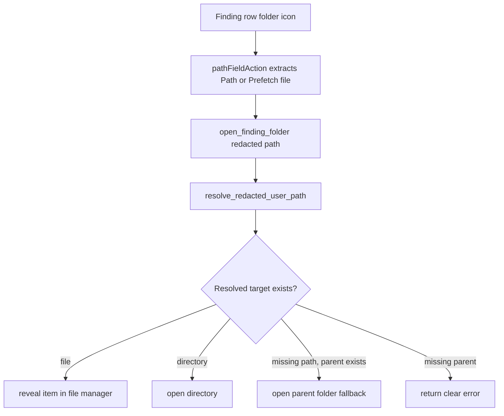
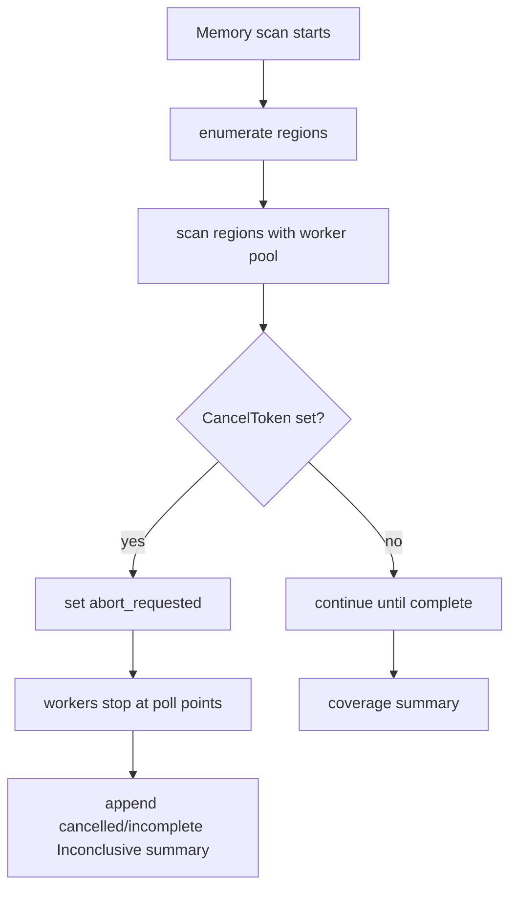

# feat: Reveal evidence files and uncap memory scans

## Overview

Two small but user-visible Prism usability fixes:

1. The folder icon on file-based findings should show the exact evidence item in the OS file manager, with the file selected/highlighted when possible, instead of only opening the parent folder.
2. The memory scanner should no longer stop automatically at the 90-second wall-clock cap. It should keep scanning until completion or explicit user cancellation.

Both changes need to preserve Prism's current integrity posture: report paths stay redacted, local-only actions resolve `<user>` only at click time, memory-scan coverage failures stay honest `Inconclusive`, and manual Stop remains responsive.

---

## Problem Frame

Operators can click a folder icon on file findings today, but the backend only opens the containing directory. In large Roblox/bootstrapper folders, that still leaves the user hunting for the actual FFlag file. The desired behavior is “take me to the evidence file” without opening the file contents.

Separately, the memory scanner has a hard `MAX_SCAN_DURATION` of 90 seconds. Recent larger memory walks can reach the time budget even when the scan is still making progress. The user wants that cap removed so the scanner can finish full coverage instead of timing out.

---

## Requirements Trace

**File reveal**

- R1. File-finding folder actions reveal/select the exact evidence file when the file still exists.
- R2. The action must not open the evidence file contents.
- R3. Directory findings keep a sensible folder behavior: open the directory itself rather than selecting it in its parent.
- R4. Stale/deleted evidence paths should preserve useful existing behavior by opening the parent folder when the parent still exists.
- R5. Redacted report paths (`<user>`) continue to resolve locally in the Rust command; no unredacted paths are added to reports or frontend state.

**Memory scan**

- R6. The memory scan no longer aborts because 90 seconds elapsed.
- R7. Manual Stop/cancel remains the supported abort path for live UI scans; cancelled memory coverage is reported with an incomplete/`Inconclusive` summary finding, not a `Clean` summary. Any partial `Suspicious`/`Flagged` evidence found before cancellation remains preserved and can still drive the overall report verdict.
- R8. No memory-scan output or tests keep stale “90s”, “time budget”, or “wall-clock cap” wording.
- R9. Non-interactive memory-scan callers (`save_report`, CLI harness, and `ScanProgress::noop()` paths) also lose the 90-second cap; this is an intentional consequence of removing the global memory-scan time limit, with process/app termination as their only external abort mechanism unless a future export-cancel feature is added.

---

## Scope Boundaries

- Do not add hidden unredacted evidence paths to signed reports.
- Do not open FFlag files in an editor/viewer from the folder icon.
- Do not redesign the finding details schema beyond existing `Path` / `Prefetch file` extraction.
- Do not change memory-scanner detection heuristics, curated rules, registry walking, or coverage thresholds.
- Do not remove non-time safety rails such as region-count caps, chunk caps, coverage-gap accounting, or manual cancellation.
- Do not add export/save cancellation in this pass; `save_report` can run longer because it re-runs scanners without a UI `CancelToken`.
- Do not add a new imported-report path policy in this pass; imported report reveal remains best-effort local path resolution.

---

## Context & Research

### Relevant Code and Patterns

- `src/App.tsx`
  - `FindingRow` renders the folder icon.
  - `pathFieldAction` enables the action only for file-surface findings and extracts `Path` or `Prefetch file` from parsed finding details.
  - `openFindingFolder` invokes the Rust command `open_finding_folder`.
- `src/App.test.ts`
  - Existing Vitest coverage pins detail parsing, including paths with commas.
  - Helper-style UI behavior is usually exported from `App.tsx` when tests need direct coverage.
- `src-tauri/src/commands.rs`
  - `open_finding_folder` resolves redacted `<user>` paths and currently opens `folder_target(path)`.
  - `folder_target` preserves current directory behavior and maps files to their parent folder.
- `src-tauri/src/lib.rs`
  - `open_finding_folder` is already registered as an invoke command.
- `src-tauri/capabilities/default.json`
  - `opener:default` is already enabled.
- `src-tauri/src/scanners/memory_scanner.rs`
  - `MAX_SCAN_DURATION` is `90s`.
  - Timeout checks exist in region enumeration, the heartbeat/watchdog thread, and after worker completion.
  - The current `timed_out` flag conflates “time cap expired” with “user clicked Stop”.
  - `timeout_allows_clean_summary` and related tests pin the old timeout semantics.
- `src-tauri/src/scanners/progress.rs`
  - `CancelToken` is the shared cancellation path used by `run_scan` / `cancel_scan` and scanner hot loops.
  - `ScanProgress::noop()` creates a private uncancellable token, so `save_report` re-scans and the CLI harness will not have the live UI Stop path after the time cap is removed.

### Institutional Learnings

- `ScanFinding::new` is the redaction boundary; scanners should continue emitting normal local paths and let the model redact usernames.
- Local-only path actions must resolve `<user>` back to the current machine in the backend command, not by leaking unredacted paths through the UI/report.
- Memory scanner edits are high-risk and should stay scoped with regression tests.

### External References

- Tauri v2 opener exposes `revealItemInDir(path)` / Rust `reveal_item_in_dir`, described as revealing a path in the system file explorer: <https://v2.tauri.app/reference/javascript/opener/#revealitemindir>
- Tauri opener default permissions include reveal-in-dir support under `opener:default`: <https://v2.tauri.app/plugin/opener/#default-permission>
- Tauri opener implementation uses native reveal/select mechanisms where possible: Windows `SHOpenFolderAndSelectItems`, macOS `NSWorkspace.activateFileViewerSelectingURLs`, and Linux/BSD `org.freedesktop.FileManager1.ShowItems` with a portal fallback: <https://github.com/tauri-apps/plugins-workspace/blob/v2/plugins/opener/src/reveal_item_in_dir.rs>
- OS-level equivalents confirm the intended behavior: Windows Explorer `/select,<object>` selects a file/folder, macOS `open -R` reveals in Finder, and freedesktop `ShowItems` asks file managers to select items in parent folders.

---

## Key Technical Decisions

- Keep the Tauri command name `open_finding_folder` for minimal frontend/registration churn, but update its internal behavior and user-facing copy to “show/reveal evidence”.
- Use the backend command as the reveal boundary because it already repairs redacted `<user>` paths. Do not call `revealItemInDir` directly from the frontend.
- Reveal only existing file paths. Keep directory paths opening as directories so existing directory-artifact findings do not regress.
- If the evidence path no longer exists but its parent does, open the parent folder as a fallback. Once a target is missing, the backend cannot reliably know whether it used to be a file or directory, so parent fallback applies to any missing path extracted from `Path` / `Prefetch file` evidence fields.
- Split memory-scan “abort requested” from “timeout” semantics. After removing the time cap, the remaining abort signal should mean user cancellation, not elapsed time.
- Cancelled memory scans should append/preserve an `Inconclusive` incomplete-coverage finding even if partial suspicious/flagged evidence was already found.

---

## Open Questions

### Resolved During Planning

- Should missing evidence paths error or open the parent folder? Resolve as parent-folder fallback when the parent exists, because this best matches current behavior and helps with stale scan results. This applies to any missing path supplied by the existing file-evidence action fields, not only paths that can still be proven to be files.
- Should directory paths be revealed/selected or opened? Resolve as open directory, because the existing folder icon behavior is already useful for directory artifacts.
- Should the command be renamed? Resolve as keep `open_finding_folder` for now; update labels and internals without widening the diff.
- Should cancellation ever become a clean summary? Resolve as no. Manual cancellation means the user interrupted coverage, so the report should stay honest and incomplete.

### Deferred to Implementation

- Exact helper names for command target classification: implementation can choose names after refactoring `commands.rs`.
- Whether to add user-visible toast errors for failed reveal actions: useful, but not required to satisfy the requested behavior.
- Whether imported reports should disable reveal actions: out of scope for this pass; keep current best-effort behavior.

---

## High-Level Technical Design

> *This illustrates the intended approach and is directional guidance for review, not implementation specification. The implementing agent should treat it as context, not code to reproduce.*

---

## Implementation Units

- [ ] U1. **Reveal evidence files from backend command**

**Goal:** Change the folder action backend so file findings reveal/select the exact evidence file while preserving redacted-path handling and directory fallback behavior.

**Requirements:** R1, R2, R3, R4, R5

**Dependencies:** None

**Files:**
- Modify: `src-tauri/src/commands.rs`
- Test: `src-tauri/src/commands.rs`

**Approach:**
- Keep `open_finding_folder(path: String)` as the Tauri command entry point.
- Preserve `resolve_redacted_user_path` as the first meaningful path operation.
- Introduce a small pure helper that classifies the resolved input into one of:
  - reveal existing file item,
  - open existing directory,
  - open parent folder fallback for a missing path whose parent exists,
  - error for empty/missing-unresolvable paths.
- For existing files, call Tauri opener's Rust reveal function with the file path, not the parent.
- For directories and stale parent fallback, reuse the existing folder-open behavior or an equivalent opener call that opens the directory rather than selecting it.
- Keep error messages local-path-only and clear: distinguish “path does not exist” from “parent folder does not exist” when practical.

**Patterns to follow:**
- Existing `resolve_redacted_user_path` and `folder_target` style in `src-tauri/src/commands.rs`.
- Existing local-only action comment that explains why `<user>` is repaired in the backend.

**Test scenarios:**
- Happy path: existing file path is classified as reveal-item, with the full file path preserved.
- Happy path: existing directory path is classified as open-directory, not reveal-file.
- Edge case: missing path with existing parent is classified as open-parent fallback.
- Error path: empty string returns `No path supplied` or equivalent.
- Error path: missing path with missing parent returns a clear error.
- Privacy/regression: redacted Windows-style and Unix-style `<user>` paths still resolve under the current profile/home path before target classification.

**Verification:**
- Clicking a file finding reveals/selects the evidence file on supported file managers.
- Clicking a directory finding still opens the directory.
- No signed report schema or scanner-emitted detail path changes are needed.

---

- [ ] U2. **Update finding-row copy and frontend path-action tests**

**Goal:** Make the UI language match reveal/select behavior and lock the path extraction contract with focused tests.

**Requirements:** R1, R2, R5

**Dependencies:** U1

**Files:**
- Modify: `src/App.tsx`
- Modify: `src/App.test.ts`

**Approach:**
- Update the folder button title and aria label from “Open containing folder” to “Show evidence in folder” / “Reveal evidence in folder” wording.
- Keep the invoke command string unchanged unless U1 deliberately adds an alias.
- Export `pathFieldAction` or a renamed equivalent only if needed for focused unit tests.
- Keep extraction limited to file-surface findings and existing fields: `Path`, `Prefetch file`.

**Patterns to follow:**
- Existing `parseFindingDetails` tests in `src/App.test.ts`.
- Existing row button behavior that stops propagation so clicking the folder icon does not expand/collapse the finding.

**Test scenarios:**
- Happy path: a file-surface finding with `Path: C:\Users\<user>\...\ClientAppSettings.json` produces an action using that exact redacted path.
- Happy path: a prefetch finding with `Prefetch file: C:\Windows\Prefetch\TOOL.EXE-123.pf` produces an action.
- Edge case: paths containing commas are preserved through `parseFindingDetails` and action extraction.
- Edge case: runtime/memory findings with `Path:` in details do not get the folder action.
- Accessibility/copy: action title or aria text uses reveal/show wording, not stale “open containing folder” wording.

**Verification:**
- The folder icon still appears only where it appeared before for file evidence.
- The UI no longer promises merely opening a parent folder when it now reveals an item.

---

- [ ] U3. **Remove the memory scan wall-clock cap**

**Goal:** Let memory scans continue past 90 seconds until completion or manual cancellation, while preserving progress heartbeat and coverage accounting.

**Requirements:** R6, R7, R8, R9

**Dependencies:** None

**Files:**
- Modify: `src-tauri/src/scanners/memory_scanner.rs`
- Test: `src-tauri/src/scanners/memory_scanner.rs`

**Approach:**
- Remove `MAX_SCAN_DURATION` and all elapsed-time checks that set the abort flag for every memory-scan caller, including live scans, export/save re-scans, and CLI/noop paths.
- Keep non-time safety rails:
  - `MAX_REGIONS_WALKED`,
  - `ABS_REGION_CAP`,
  - `MAX_CHUNK_BYTES`,
  - adaptive read fallback,
  - coverage-gap materiality thresholds.
- Replace the overloaded `timed_out` flag with clearer cancellation/abort naming inside the memory walk.
- Keep the heartbeat thread, but make it run until shutdown or cancellation rather than until a time budget expires.
- Ensure region enumeration and worker scans still poll cancellation and stop at existing safe poll points.
- Remove timeout-specific clean-summary logic. A completed scan summarizes by coverage; a cancelled live scan summarizes as incomplete. Non-interactive/noop callers have no external cancellation path after the cap is removed, so they either complete, fail by coverage/API conditions, or are terminated externally.
- Replace stale descriptions containing “90s”, “time budget”, or “wall-clock cap” with completion/cancellation wording.

**Patterns to follow:**
- Existing environmental-failure policy: coverage failures are `Inconclusive`, not `Suspicious`.
- Existing cancellation flow through `ScanProgress::is_cancelled()` / `CancelToken`.
- Existing comment discipline in `memory_scanner.rs` explaining why scanner summary states are honest.

**Test scenarios:**
- Happy path: completed scan with acceptable coverage can still produce a Clean summary.
- Error path: incomplete region enumeration remains Inconclusive.
- Error path: no successful memory reads remains Inconclusive.
- Error path: material coverage gap remains Inconclusive.
- Cancellation path: live UI user cancellation produces an Inconclusive “cancelled/incomplete” memory summary finding, not timeout wording.
- Cancellation path: partial suspicious/flagged findings are preserved and an incomplete/cancelled summary is appended, so the overall report verdict is not forcibly downgraded to Inconclusive.
- Non-interactive path: `ScanProgress::noop()` callers no longer have a 90-second abort branch or timeout summary.
- Regression: no test or output string references `90s`, `time budget`, or `wall-clock cap` after removal.

**Verification:**
- A memory scan can run longer than 90 seconds without automatic abort.
- The Stop button still causes the memory scanner to return as soon as current poll granularity allows.
- Memory coverage details remain present in summary findings.

---

- [ ] U4. **Run targeted regression and live checks**

**Goal:** Verify the two behavior changes without destabilizing unrelated scanners or frontend UI.

**Requirements:** R1-R9

**Dependencies:** U1, U2, U3

**Files:**
- Test: `src/App.test.ts`
- Test: `src-tauri/src/scanners/memory_scanner.rs`
- Test: `src-tauri/src/commands.rs`

**Approach:**
- Run frontend tests/build after UI helper/copy changes.
- Run backend library tests focused on `memory_scanner` and then the broader Prism lib tests.
- Manually validate on Windows when possible:
  - a `ClientAppSettings.json` finding selects/highlights the file in Explorer,
  - a stale finding opens the parent folder fallback,
  - a live memory scan that exceeds 90 seconds keeps progressing,
  - Stop during live memory scanning returns an incomplete/cancelled result,
  - export/save and harness paths no longer emit timeout summaries when they exceed 90 seconds.

**Patterns to follow:**
- Existing repo testing expectations in `AGENTS.md`.
- Existing memory-scan harness workflow for live validation.

**Test scenarios:**
- Integration/manual: scanned FFlag file in a folder with many siblings is selected after clicking the folder icon.
- Integration/manual: folder icon does not open the JSON/text file itself.
- Integration/manual: long live memory scan exceeds 90 seconds and finishes or continues until manual Stop.
- Integration/manual: long export/save or harness memory scan exceeds 90 seconds without timeout wording, with the accepted limitation that these paths are not cancellable from the live scan Stop button.
- Integration/manual: cancelling after partial memory findings keeps evidence and marks memory coverage incomplete.

**Verification:**
- Tests pass.
- Manual validation proves the exact user pain is fixed: the operator no longer has to hunt through a huge folder for the FFlag file.

---

## System-Wide Impact

- **Interaction graph:** `FindingRow` → `openFindingFolder` → Tauri invoke → `commands.rs::open_finding_folder` → OS file manager / Tauri opener.
- **Error propagation:** reveal/open errors currently log in the frontend; backend should return precise errors even if the UI only logs them in this pass.
- **State lifecycle risks:** scan results can become stale between scan completion/import and click. Parent-folder fallback handles the common stale-file case.
- **API surface parity:** keep the existing command name to avoid changing Tauri command registration and frontend invoke wiring.
- **Integration coverage:** OS-level file-manager selection requires manual Windows/macOS/Linux validation; unit tests can only verify target classification and invoke inputs.
- **Unchanged invariants:** report signing/redaction stays unchanged; memory scanner verdict model stays `Clean < Inconclusive < Suspicious < Flagged`; coverage gaps remain honest Inconclusive conditions.

---

## Risks & Dependencies

| Risk | Mitigation |
|------|------------|
| Tauri opener reveal requires existing path and may fail on stale files | Classify existence before reveal; open parent folder fallback when possible. |
| Linux/BSD file managers may only open parent rather than select item | Accept platform fallback; Tauri opener already uses `FileManager1.ShowItems` where available and falls back to portal directory open. |
| Imported reports with `<user>` paths can resolve to the reviewer’s local same-relative path | Treat reveal as best-effort local convenience only; do not imply imported evidence proof. Future work can disable or relabel imported-report reveal. |
| Removing the 90s cap can allow very long live scans | Keep heartbeat/progress and manual Stop; keep region/chunk/cap safety rails. |
| Removing the 90s cap can make `save_report` export re-scans and CLI/noop scans run indefinitely | Accept as the explicit global time-limit removal for this pass; note future work could add export cancellation or a separate caller policy if needed. |
| A blocking `ReadProcessMemory` call cannot be interrupted mid-call | Document/accept as a consequence of removing the wall-clock cap; cancellation remains poll-point based. Avoid widening scope into a subprocess watchdog. |
| `memory_scanner.rs` is large and fragile | Keep edits localized to timeout/cancellation plumbing and summary/tests. |

---

## Documentation / Operational Notes

- If release notes are updated later, describe this as: “Folder icon now reveals the evidence file in Explorer/Finder when possible” and “Memory scan no longer has a fixed 90s time cap; use Stop to cancel long scans.”
- For tournament operators, the practical UX change is that long scans may take longer but should produce fuller memory coverage instead of timing out.
- Export/save re-runs can also take longer because they use uncancellable scanner paths today; adding export cancellation is a separate future improvement if this becomes annoying.

---

## Sources & References

- Related code: `src/App.tsx`
- Related code: `src/App.test.ts`
- Related code: `src-tauri/src/commands.rs`
- Related code: `src-tauri/src/scanners/memory_scanner.rs`
- Related code: `src-tauri/src/scanners/progress.rs`
- Tauri opener reveal API: <https://v2.tauri.app/reference/javascript/opener/#revealitemindir>
- Tauri opener permissions: <https://v2.tauri.app/plugin/opener/#default-permission>
- Tauri opener native reveal implementation: <https://github.com/tauri-apps/plugins-workspace/blob/v2/plugins/opener/src/reveal_item_in_dir.rs>
- Windows Explorer selection option: <https://ftp.zx.net.nz/pub/archive/ftp.microsoft.com/MISC/KB/en-us/152/457.HTM>
- macOS `open -R`: <https://keith.github.io/xcode-man-pages/open.1.html>
- freedesktop file-manager `ShowItems`: <https://wiki.freedesktop.org/www/Specifications/file-manager-interface/>
